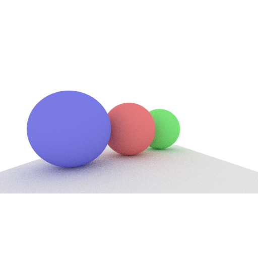

# rusmallpt

Minimal but extensible implementation of path tracing in Rust.



## Build

```
cargo build
```

## Run

```
cargo run
```

## Extension

You can consider adding following features.

* More light transport algorithms.
* More `BxDF`s.
* Implement `BSDF`(collection of `BxDF`s).
* Add triangle shape and bvh to render polygons.
* Implement `.obj`, `.gltf` loader.

## Externals

* [rand](https://docs.rs/rand/latest/rand/)